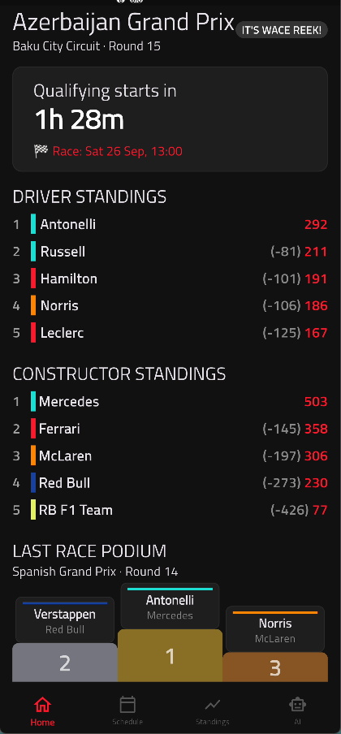
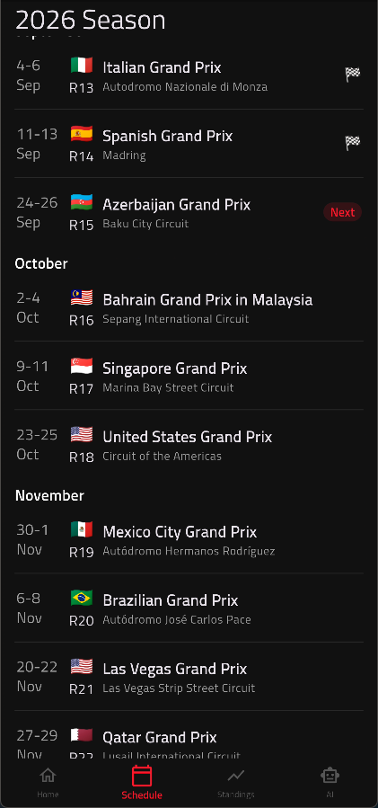
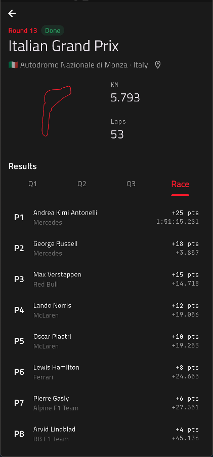
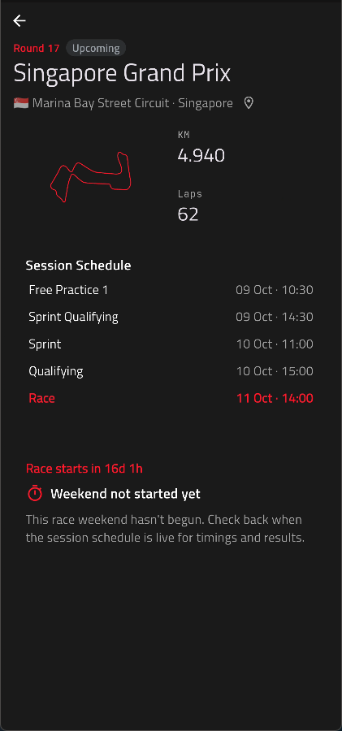
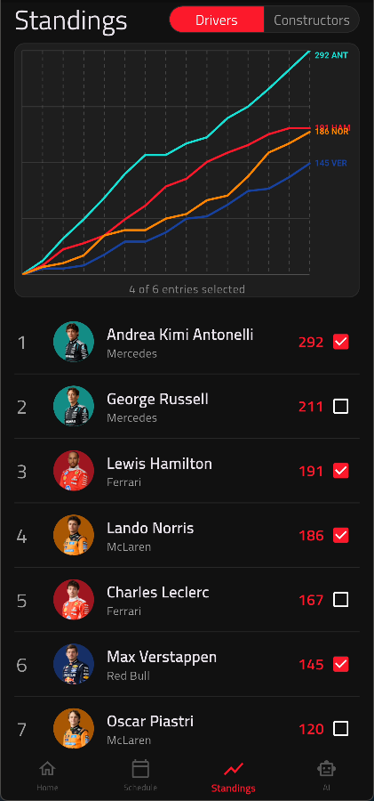
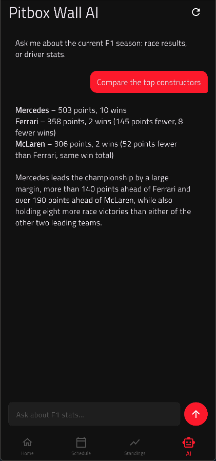

# 🏎️ Pitbox Wall — F1 Race Companion App

A Flutter mobile app (Android + iOS) that combines a polished race weekend experience with real data visualisation and an AI assistant for F1 stats queries.

Built on the [Jolpica F1 API](https://api.jolpi.ca/ergast/f1/) for session times, with driver photos served from F1's official Cloudinary CDN.

---

## Highlights

- **AI assistant** — natural-language F1 stats queries answered from live season data (Groq Llama 3.3 70B)
- **Bump chart** — driver standings evolution across the season (`CustomPainter`, team-coloured lines, touch interaction)
- **Offline-first** — Drift (SQLite) cache with TTL strategy per data type
- **Clean Architecture + Cubit** — portfolio-grade structure, tests written per phase

---

## Screenshots

| Home — Next Session | Schedule — Full Calendar | Past Race Weekend |
|---|---|---|
|  |  |  |
| **Live countdown** to the next session, season standings summary (top 3 drivers / top 2 constructors), last race winner card. Tap to open Race Weekend. | **Month-grouped** calendar of every round. Past races show winner & are tappable → Race Weekend detail. Skeleton loaders while fetching. | Full-screen detail (bottom nav hidden). Tabs: **Qualifying / Race / Sprint** with full results tables (grid, gaps, fastest lap, DNF). |

| Future Race Weekend | Driver Card — Season Stats | AI Assistant — Chat |
|---|---|---|
|  |  |  |
| Full-screen detail (bottom nav hidden). Session schedule sorted chronologically. | Driver headshot from F1 CDN, car number, nationality, team. Season stats (wins, podiums, poles, FL, DNFs). Points progression mini-chart. Race-by-race result chips. | **Pitbox AI** — streaming chat bubbles. System prompt injects current standings + last 3 race results from cache. Ask: *"How many times has Norris won from pole?"*, *"Compare Hamilton vs Russell"*. Answers only from injected data. |

---

## App Architecture

```
lib/
├── core/
│   ├── di/                  # GetIt service locator
│   ├── error/               # Failures, Either type
│   ├── network/             # Dio clients (Jolpica + OpenF1), interceptors
│   ├── navigation/          # go_router with StatefulShellRoute
│   ├── db/                  # Drift (SQLite) database & DAOs
│   └── utils/               # F1Cdn URL builder, date formatting
├── features/
│   ├── home/                # Next session countdown + summary cards
│   ├── schedule/            # Season calendar, month-grouped
│   ├── standings/           # Driver/Constructor tables + bump chart
│   ├── results/             # Race Weekend (qualifying/race/sprint)
│   ├── driver/              # Driver Card detail screen
│   └── ai_assistant/        # Riverpod-based chat (isolated feature)
└── shared/
    ├── widgets/             # Skeleton loaders, error view, app scaffold
    └── theme/               # F1 Dark theme (Titillium Web + JetBrains Mono)
```

**Clean Architecture per feature** — each feature is fully self-contained with `data/`, `domain/`, `presentation/` layers.

---

## Tech Stack

| Layer | Choice | Why |
|---|---|---|
| Framework | Flutter (Android + iOS) | Single codebase, native performance |
| State Management | **Cubit** (bloc) | Less boilerplate than Bloc, simpler tests |
| DI | GetIt | Compile-time safe, familiar |
| Navigation | go_router | Declarative, shell route for bottom nav |
| Local Cache | **Drift (SQLite)** | Type-safe, relational, generated DAOs |
| HTTP | Dio + Retrofit | Interceptors, streaming, codegen |
| Charts | **CustomPainter** bump chart | Hand-rolled, team-coloured, touch interaction |
| AI Model | **Groq (Llama 3.3 70B)** | Free tier 14.4k req/day, 128k context, OpenAI-compatible |
| Models | Freezed + json_serializable | Immutable, sealed classes, codegen |
| Testing | mocktail + flutter_test | No `bloc_test` (version conflicts) |
| Fonts | Titillium Web + JetBrains Mono | Closest free match to F1 branding |
| Images | cached_network_image | F1 Cloudinary CDN deterministic URLs |

---

## Data Sources

| Source | Base URL | Auth | Purpose |
|---|---|---|---|
| **Jolpica F1** | `https://api.jolpi.ca/ergast/f1/` | None | Standings, results, schedule, driver roster (1950→now) |
| **F1 Media CDN** | `https://media.formula1.com/image/upload/` | None | Driver photos & team logos (deterministic Cloudinary URLs) |

**Jolpica endpoints used:**
- `/current/races` → season schedule + all session datetimes (FP1, FP2, FP3, Sprint, Qualifying, Race)
- `/current/driverStandings` + `/current/constructorStandings` → current standings
- `/current/{round}/results` + `/qualifying` → race weekend results
- `/{season}/{round}/driverStandings` → standings per round (batched for bump chart)
- `/current/drivers/{id}/results` → driver's season results
- `/current/drivers` → full driver roster (cached for F1 CDN URL building)

---

## Screens — Deep Dive

### 1. Home (`/home`) — "The Thursday Screen"
The screen you open on a Thursday before a GP weekend.

- **Live countdown** to the next session (FP1 → FP2 → FP3 → Qualifying → Sprint → Race) in monospace font
- **Current GP header**: race name, circuit, country flag
- **Season summary**: top 3 drivers + top 2 constructors (mini standings cards)
- **Last race winner**: driver, team, gap to P2
- Tap anywhere → pushes full-screen **Race Weekend** detail

### 2. Schedule (`/schedule`) — Full Season Calendar
- **Month-grouped** list (auto-split from chronological race list)
- Each round: circuit, country flag, date, session icons
- **Past races**: show winner, tappable → Race Weekend detail
- **Upcoming races**: show session timetable on expand (Phase 2)
- **Current round** highlighted with "NEXT" badge
- Skeleton loaders during fetch; cache banner ("Loaded from cache")

### 3. Standings (`/standings`) — The Data Screen ⭐
- **Toggle**: Drivers / Constructors (chip selector, top-right)
- **Current standings table**: position, driver/team, points, team-colour left border
- **Bump chart** (custom `CustomPainter`):
  - X-axis: rounds 1–N
  - Y-axis: championship position (1 at top, inverted)
  - One line per driver, coloured by **team** (not driver)
  - **Touch interaction**: tap line → highlights driver, shows points tooltip
  - Filter: Top 5 / Top 10 / All (animates line visibility)
- Bump chart data: batched round-by-round standings calls on first open, each cached forever

### 4. Race Weekend (`/race/:round`) — Full-Screen Detail
Pushed outside the shell route → **bottom nav hidden**, own Scaffold with back arrow.

- **Header**: round number, race name, circuit, country
- **Session schedule**: all non-null sessions sorted chronologically, Race highlighted in F1 red
- **Tab selector**: Qualifying / Race / Sprint (if applicable)
- **Qualifying table**: grid order, best lap, gap to pole
- **Race results table**: position, driver, team, time/gap, fastest lap badge, DNF highlighted
- **Pit stop summary** (Phase 2)

### 5. Driver Card (`/driver/:id`) — Full-Screen Detail
- **Hero**: driver headshot (F1 CDN), car number (large, red), name, team, nationality
- **Season stats grid**: wins, podiums, poles, fastest laps, DNFs
- **Points progression**: simple line chart (season-long)
- **Race-by-race**: result chips (position, status, points)

### 6. Constructor Card — Full-Screen Detail
- Team logo (F1 CDN white variant)
- Current driver lineup from standings data
- Race-by-race constructor results & points
- Optional external links (team website, Wikipedia)

### 7. AI Assistant (`/ai`) — Pitbox AI 🤖
**Built with Riverpod (isolated feature — rest of app uses Cubit).**

- **Chat-style UI**: user/assistant bubbles, streaming response animation
- **System prompt** injects current season context fresh from Drift cache on every request:
  ```
  === 2026 F1 SEASON DATA ===
  After round 12 of 24
  
  DRIVER STANDINGS:
  1. NOR  MCL  198pts
  2. VER  RBR  187pts
  3. PIA  MCL  181pts
  ...
  
  LAST RACE — British GP (Round 12):
  P1: NOR (MCL) +4.2s
  P2: PIA (MCL) +12.1s
  ...
  
  NEXT SESSION: Hungarian GP — Race — Sun 27 Jul 14:00 UTC
  ```
- **Model**: Groq Llama 3.3 70B (OpenAI-compatible, streaming)
- **No RAG, no tools** — full season context fits in ~2000 tokens (128k window)
- **Guardrails**: "Answer ONLY from data above. If not in data, say 'I don't have that data.'"
- **Conversation history** maintained in session (no persistence)

---

## Offline-First Cache Strategy

**Rule**: if the event is over → cache forever. If data can change → TTL.

| Data | Strategy | TTL |
|---|---|---|
| Completed race/qualifying results | Cache forever | ∞ |
| Driver standings per round (bump chart) | Cache forever | ∞ |
| Driver roster (registry for F1 CDN) | Long TTL | 7 days |
| Driver/constructor metadata | Long TTL | 7 days |
| Season schedule + session datetimes | Medium TTL | 24 hours |
| Current driver/constructor standings | Short TTL | 1 hour |
| Active race weekend data | Very short TTL | 30 min |

**Cache-first pattern** (every repository):
```dart
Future<Either<Failure, T>> get(String key) async {
  final cached = await db.getFresh(key);
  if (cached != null) return Right(cached.data);   // fresh → return
  return fetchAndCache(key);                        // empty/stale → fetch
}
```

**Bump chart special case**: batches up to 24 round-standings calls on first open. Progress tracked in Drift so interrupted fetches resume. Linear progress indicator shown on first launch.

**Error states** — only two: loading → content, or loading → error. Stale cache is **never** an error (served instantly + background refresh). Error = empty cache + failed network. Shared `ErrorRetryView` widget with retry + exponential backoff (2s→4s→8s→16s, cap 60s).

---

## Navigation — go_router

```
StatefulShellRoute.indexedStack  ← 4 tabs, bottom nav ALWAYS visible
├── /home        (HomePage)
├── /schedule    (SchedulePage)
├── /standings   (StandingsPage)
├── /ai          (AiPage)
│
├── /race/:round    ← OUTSIDE shell → full-screen, own Scaffold, back arrow
└── /driver/:id     ← OUTSIDE shell → full-screen, own Scaffold, back arrow
```

`StatefulShellRoute.indexedStack` preserves scroll position and Cubit state per tab.

---

## AI Assistant — Technical Detail

**Flow:**
1. User sends message → `ChatNotifier.sendMessage()`
2. Appends user bubble immediately
3. Appends empty AI bubble (`isStreaming: true`)
4. Builds context from Drift cache (standings + last 3 races + next session)
5. Streams from Groq → updates last bubble **in place** (no full list rebuild)
6. On stream end → marks `isStreaming: false`
7. On error → replaces streaming bubble with error message (history preserved)

**Context builder** reads from Drift providers — no extra network calls.

---

## Running the App

```bash
# 1. Clone & install
flutter pub get

# 2. Generate code (Freezed, Retrofit, Drift)
dart run build_runner build --delete-conflicting-outputs

# 3. Add Groq API key (free at console.groq.com)
echo "GROQ_API_KEY=your_key_here" > .env

# 4. Run
flutter run
```

**Requirements:** Flutter 3.24+, Dart 3.5+, Android Studio / Xcode for device testing.

---

## License

MIT — use freely for learning, portfolio, or as a base for your own F1 app.

---

***Not affiliated with Formula 1, FIA, or FOM. Data from open Jolpica F1 API. Driver images from F1's public Cloudinary CDN.***